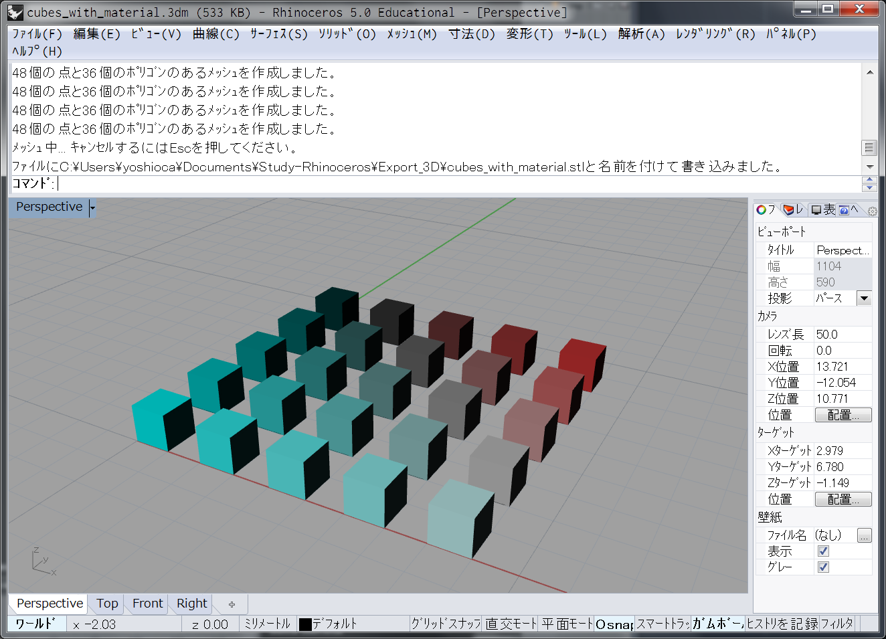

# set_material  


Rhino で、色を作って書き出し。  
Blender等 に読み込み、レンダリング。  
この想定で考えてみる。  


---  


###  色付き 3D データの作り方

ライノでオブジェクトに色を付ける方法として、  
オブジェクトの色を指定する方法や、マテリアルで指定する等がある。  

書き出すときに反映されるのは、マテリアル。  

マテリアルを作って、色を指定してアサインするスクリプトはこんな感じ。  
```python
### set color
rs.AddMaterialToObject(tmp_box)

index = rs.ObjectMaterialIndex(tmp_box)

rs.MaterialName(index, str(i) + "_" +str(j))
rs.MaterialColor(index,  ((255 / count) * i, 255 - ((255 / count) * j), 255 - ((255 / count) * j)))

```

出力結果はこんな感じ。  
  


色付き 3D データの書き出しのファイルフォーマットは、  
FBX が良さそう。  


---  